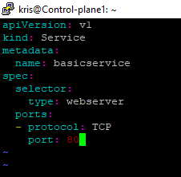

# **Exercise 2.1: Overview and Preliminaries**

Create a two-nodeUbuntu 24.04 cluster. Using two nodes allows an understanding of some issues and configurations found in a production environment.  Currently 2 vCPU and 8G of memory allows for quick labs.  As we will be working with images it is suggested that you allocate at least 20GB of disk space for the control plane (cp) node, more is better. Other Linuxdistributions should work in a very similar manner, but have not been tested.

### Summary:
* 2 CPU
* 8G memory  
* 20G+ disk on control plane node
* Don’t use 10.0.0.0/8 network for nodes  
* No firewall
* Disable swap
* Disable SELinux and AppArmor

I set up two ubuntu VM. which will be my **Control-Plane** and **Worker-Node**. Then I log into my nodes using **PUTTY**

## **Deploy a Control Plane Node using Kubeadm**

### Download shellscripts and YAML files

To assist with setting up your cluster please download the tarball of shell scripts and YAML files. The **`k8scp.sh`** and **`k8sWorker.sh`** scripts deploy a Kubernetes cluster using **kubeadm** and use **Cilium** for **networking**. Should the file not be found you can always use a browser to investigate the parent directory.

- Using the **wget** and **tar** commands i download and extract the course tarball to my **cp node** and **worker node**

Run:
```
# Download tarball file provided in the lab

$ wget --user=LFtraining --password=Penguin2014 https://cm.lf.training/LFD259/LFD259_V2025-05-28_SOLUTIONS.tar.xz

# Extract the file in your home directory
$ tar -xvf LFD259_V2025-05-28_SOLUTIONS.tar.xz
```

The virtual machine’s hostname might vary depending on how it was created.  If you want your VM to have the samehostname as in our lab examples, run the following command. This is an OPTIONAL step.

```
$ sudo hostnamectl set-hostname Control-Plane

$ bash
```

- Review the script to install and begin the configuration of the cp kubernetes server.  You may need to change the find command search directory for your home directory depending on how and where you downloaded the tarball.


```
# Find the k8scp.sh file location
$ find $HOME -name k8scp.sh

# View the k8scp.sh file content
$ more LFD259/SOLUTIONS/s_02/k8scp.sh

See its content:

# Install the Kubernetes software, and lock the version 
sudo apt update 
sudo apt-get -y install kubelet=1.33.1-1.1 kubeadm=1.33.1-1.1 kubectl=1.33.1-1.1
sudo apt-mark hold kubelet kubeadm kubectl

# Ensure Kubelet is running
sudo systemctl enable --now kubelet

# Disable swap just in case 
sudo swapoff -a
```
- Copy files to your home directory first.

```
# Copy the k8scp.sh file to your current directory

$ cp LFD259/SOLUTIONS/s_02/k8scp.sh .
```

- Run the script as an argument to the bash shell. You will need the kubeadm join command shown near the end of the output when you add the worker/minion node in a future step. Use the tee command to save the output of the script, incase you cannot scroll back to find the kubeadm join in the script output.  Please note the following is one command and then its output.

`$ bash k8scp.sh | tee $HOME/cp.out`
```
# output from script above

Your Kubernetes control-plane has initialized successfully!

To start using your cluster, you need to run the following as a regular user:

  mkdir -p $HOME/.kube
  sudo cp -i /etc/kubernetes/admin.conf $HOME/.kube/config
  sudo chown $(id -u):$(id -g) $HOME/.kube/config

Alternatively, if you are the root user, you can run:

  export KUBECONFIG=/etc/kubernetes/admin.conf

You should now deploy a pod network to the cluster.
Run "kubectl apply -f [podnetwork].yaml" with one of the options listed at:
  https://kubernetes.io/docs/concepts/cluster-administration/addons/

Then you can join any number of worker nodes by running the following on each as root:

kubeadm join 192.168.56.101:6443 --token 8c0dp4.vc5wn73thmti3qyx \
        --discovery-token-ca-cert-hash sha256:60c73510485201c3015b44f4d3f03017f83b9d5f748905dffc000cccf01c9b7c
kris@Control-Plane:~$
```
**NOTE:** If kubeadm,kubelet and Kubectl did not install from the script above you can install it manually using [kubenetes doc](https://kubernetes.io/docs/setup/production-environment/tools/kubeadm/install-kubeadm/#installing-kubeadm-kubelet-and-kubectl) on both nodes

- see code here from kubernetes doc above
```
$ sudo apt-get update

$ sudo apt-get install -y apt-transport-https ca-certificates curl gpg

$ curl -fsSL https://pkgs.k8s.io/core:/stable:/v1.33/deb/Release.key | sudo gpg --dearmor -o /etc/apt/keyrings/kubernetes-apt-keyring.gpg

$ echo 'deb [signed-by=/etc/apt/keyrings/kubernetes-apt-keyring.gpg] https://pkgs.k8s.io/core:/stable:/v1.33/deb/ /' | sudo tee /etc/apt/sources.list.d/kubernetes.list

# Update apt package index, install kubelet,kubeadm and kubectl

$ sudo apt-get update
$ sudo apt-get install -y kubelet kubeadm kubectl
$ sudo apt-mark hold kubelet kubeadm kubectl

$ sudo systemctl enable --now kubelet
```
Check kubeadm, kubelet and kubectl version installed

`kubeadm version`

`kubelet --version`

`kubectl version --client`


## Deploy a Worker Node using Kubeadm

Open a separate terminal in my PUTTY to launch my second node, which will be my worker.

- Use the previous wget command to download the tarball to the worker node. Extract the files with tar as done on CP Node. Find and copy the **`k8sWorker.sh`** file to my home directory then view it. just like the steps did in the CP Node.

On Worker Node, Run:
```
# Download tarball file provided in the lab
$ wget --user=LFtraining --password=Penguin2014 https://cm.lf.training/LFD259/LFD259_V2025-05-28_SOLUTIONS.tar.xz

# Extract the file in your home directory
$ tar -xvf LFD259_V2025-05-28_SOLUTIONS.tar.xz

# Find the k8sWorker.sh file location
$ find $HOME -name k8sWorker.sh

# View the k8sWorker.sh file content
$ more LFD259/SOLUTIONS/s_02/k8sWorker.sh

# Copy the k8sWorker.sh file to your current directory
$ cp LFD259/SOLUTIONS/s_02/k8sWorker.sh .

# Run the script on the second node.  Again please note you may have questions during the update.  Allow daemons torestart, typeyes, and use the local installed version, usually option 2. For troubleshooting you may want to write output to a a file using the tee command

$ bash k8sWorker.sh | tee worker.out
```
Check the status of containerd

`sudo systemctl status containerd`


- When the script is done the worker node is ready to join the cluster.  The kubeadm join statement can be found near the end of thekubeadm init output on the cp node. It should also be in the file cp.out as well.

- See nodes before worker join CP clusters 


### Join worker node to cluster

Run `kubeadm token create --print-join-command` on cp node to retrieve join command


- On the worker node Run the retrieve kubeadm join command command retrieved from the cp to join the worker node to the cluster

```
kubeadm join 192.168.56.101:6443 --token 24ee2z.lfx5xzkq8023z08i --discovery-token-ca-c                                                                                      ert-hash sha256:60c73510485201c3015b44f4d3f03017f83b9d5f748905dffc000cccf01c9b7c

```
- Check to confirm that my worker node has join the cluster

Run on control plan:

`kubectl get nodes`


### Configure the Control Plane Node

On the cp node. Install a text editor. While the lab uses vim, any text editor such as **emacs** or **nano** will work.

Also install the **bash-completion** package

`sudo apt-get install bash-completion -y`

## **Create a Basic Pod**
- A yaml file named **basic.yaml** has been created and located in **LFD259/SOLUTIONS/s_02** directory.

run `find ~ -name basic.yaml 2>/dev/null` to find the **basic.yaml** file path

view the content of the yaml file: `cat LFD259/SOLUTIONS/s_02/basic.yaml`

Run : `kubectl create -f /home/kris/LFD259/SOLUTIONS/s_02/basic.yaml` to create the pod

Run : `kubectl get pod` to se the pod created


Run : `kubectl describe pod basicpod`

Run : `kubectl delete pod basicpod`


- ### Configure the pod to expose port 80
---
on my home director **/home/kris** I will create a **basic.yaml** file using vim editor.

Run: `vim basic.yaml`


Create the pod and verify it is running.  Use the **-o wide** option to see the **internal IP** assigned to the pod, as well as NOMINATED **NODE**, which is used by the **scheduler** and **READINESS** GATES which show if experimental features are enabled. Using **curl** and the pods IP address you should get the default **nginx welcome web page**

Run : `kubectl create -f basic.yaml` 

Run : `kubectl get pod -o wide`

Run : `curl http://10.0.1.217`

Run : `kubectl delete pod basicpod`


- ### **create a simple service to expose the pod to other nodes and pods in the cluster**
---
Now I'll create a simple **service** to expose the pod to other nodes and pods in the cluster. The service YAML will have the same four sections as a pod, but different spec configuration and the addition of a **selector**

Run : `vim basicservice.yaml`



On the Pod yaml file **(basic.yaml)** I will also add a **label** to the pod and a **selector** to the service so it knows which object to communicate with 

Run : `vim basic.yaml`


Create the new pod and service. Verify both have been created. 

Run : `kubectl create -f basic.yaml`

Run : `kubectl create -f basicservice.yaml`

Run: `kubectl get pod`

Run : `kubectl get svc`

Test access to the web server using the **CLUSTER-IP** for the basicservice. 

Run : `curl http://10.99.178.37`


- Now I'll expose the service to outside the cluster as well. Delete the created service, edit the file and add a **Node service** type declaration.

Run : `kubectl delete svc basicservice`

Run : `vim basicservice.yaml`


Create the service again. Note there is a different service TYPE now **"NodePort"**

Run : `kubectl create -f basicservice.yaml`

Run : `kubectl get svc`

Using the **public IP** address of the **node** and the high port **(32689)** I will be able to test access to the **webserver**.  Using **curl to ifconfig.io** my node public IP is **(102.22.175.20)**. Note that testing from within a GCE or AWS node will not work. Use a local to your terminal or web browser to test

Run : `curl ifconfig.io`

Run:  `curl http://102.22.175.20:32689`

Note: My Nodes has no public IP hence `curl http://102.22.175.20:32689` failed

I run `kubectl get get nodes -o wide` to retrieve the internal IP **(192.168.1.67)**

Then i run `curl http://192.168.1.67:32689`


## **Multi-Container Pods**
Using a single container per pod allows for the most granularity and decoupling. There are still some reasons to deploy multiple containers, sometimes called **composite** containers, in a single pod. The secondary containers can handle **logging** or enhance the **primary pod**, the sidecar concept, or acting as a proxy to the outside, the **ambassador concept**, or modifying data to meet an external format such as an adapter. All three concepts are secondary containers to performa function the primary container does not.

- I will add a second container to the pod to handle logging Without going into details of how to use **fluentd** we will add a logging container to the existing pod from its own repository.  The second container would act as a **sidecar**. At this state we will just add the second container and verify it is running.  In the **Deployment Configuration** chapter we will continue to work on this pod by adding **persistent** storage and configure **fluentd** via a **configMap**.

- Edit the YAML file and add a **fluentd** container. The dash should line up with the previous container dash. At this point a name and image should be enough to start the second container.

Run" `vim basic.yaml`


- Delete and create the pod again. The commands can be typed on a single line, separated by a semicolon.  This time you should see **2/2 under the READY column**.  You should also find information on the **fluentd** container inside of the kubectl describe output.

Run : `kubectl delete pod basicpod ; kubectl create -f basic.yaml`

Run : `kubectl get pod`

Run : `kubectl describe pod basicpod`

- shutdown pod for now. i will use it later in the future

Run : `kubectl delete pod basicpod`


## **Create a Simple Deployment**
Creating a pod does not take advantage of orchestration abilities of Kubernetes.  We will now create a **Deployment** which gives us **scalability**, **reliability**, and **updates**

- I will run a containerized webserver nginx.  Use kubectl create to create a simple, single replica deployment running the nginx web server. It will create a single pod as we did previously but with new controllers to ensure it runs as well as other features.

Run : `kubectl create deployment firstpod --image=nginx`


- Verify the new deployment exists and the desired number of pods matches the current number.Using a comma, you can request two resource types at once

Run : `kubectl get deployment,pod`


- View the details of the deployment, then the pod. Work through the output slowly. Knowing what a healthy deploymentand looks like can be helpful when troubleshooting issues

Run : `kubectl describe deployment firstpod`


Run : `kubectl describe pod firstpod-57fcd95588`


- Note that the resources are in the **default** namespace. Get a list of available namespaces.

NOTE: There are 4 default namespace

Run : `kubectl get namespaces`

- Check pods in the kube-system namespace and also check pod in all namespace

Run : `kubectl get pod -n kube-system`

Run : `kubectl get pod --all-namespace`


- View several **resources** at once.  Note that most resources have a short name such as **rs** for **ReplicaSet**, **po** for **Pod**, **svc** for **Service**, and **ep** for **endpoint**. Note the endpoint still exists after we deleted the pod.

Run : `kubectl get deploy,rs,po,svc,ep`

- Now delete deployment. when check you will confirm only **svc** and **ep** are the onlky resource that is left

Run : `kubectl delete deployment firstpod`

Run : `kubectl get deploy,rs,po,svc,ep`

- Now proceed to delete the **"basicservice"** service as well as we dont need for now

Run : `kubectl delete svc basicservice`


The End 

