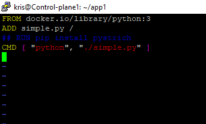

## **Exercise 3.1: Deploy a New Application**

In this lab we will deploy a very simple **Python** application, test it using **Podman**, ingest it into **Kubernetes** and con-figure **probes** to ensure it continues to run.  This lab requires the completion of the previous lab, the installation and configuration of a **Kubernetes cluster**.Note that **Podman** and **crictl** use the same syntax as **docker**, so the labs should work the same way if you happen to be using Docker instead.

### **Working with A Simple Python Script**
---
- Install python on my cp node. 

Run : `sudo apt-get -y install python3`

- Locate the python binary on my system.

Run : ̃`which python3`


- Create and change into a new directory. The **Podman** build process pulls everything from the current directory into the image file by default. Make sure the chosen directory is empty.

Run : `mkdir app1`

Run : `cd app1`

Run :  `ls -l`


- Create a simple python script which prints the time and hostname every 5 seconds. There are six commented parts tothis script, which should explain what each part is meant to do.  The script is included with others in the course tar file,you may consider using thefindcommand used before to find and copy over the file.While the command showsvimas an example other text editors such asnanowork just as well.

Run : `vim simple.py` and the file below

```
#!/usr/bin/python3
## Import the necessary modules
import time
import socket

## Use an ongoing while loop to generate output
while True :

## Set the hostname and the current date
  host = socket.gethostname()
  date = time.strftime("%Y-%m-%d %H:%M:%S")

## Convert the date output to a string
  now = str(date)

## Open the file named date in append mode
## Append the output of hostname and time
  f = open("date.out", "a" )
  f.write(now + "\n")
  f.write(host + "\n")
  f.close()

## Sleep for five seconds then continue the loop
  time.sleep(5)
```
- Make the file executable and test that it works.  Use **Ctrl-C** to interrupt the **while loop** after 20 or 30 seconds.  The output will be sent to a newly created file in your current directory called **date.out**.

Run : `chmod +x simple.py`

Run : `./simple.py`


- Verify the output has node name and timedate stamps

Run : `ls`  then  `cat date.out`


- Create a text file named **Dockerfile**

We will use three statements,**FROM** to declare which version of **Python** to use,**ADD** to include our script and **CMD** to indicate the action of the container. Should you be including more complex tasks you may need to install extra libraries,shown commented out as **RUN** pip install in the following example

```
# Dockerfile

FROM docker.io/library/python:3
ADD simple.py /
## RUN pip install pystrich
CMD [ "python", "./simple.py" ]
```

Run : `vim Dockerfile` and add the text above



- As sometimes happens with open source projects the upstream version may have hiccups or not be available.  When this happens we could make the tools from source code or install a binary someone else has created. For time reasons we will install an already created binary.

### Install Podman
---

Run : `curl -fsSL -o podman-linux-amd64.tar.gz https://github.com/mgoltzsche/podman-static/releases/latest/download/podman-linux-amd64.tar.gz`

Run : `tar -xf podman-linux-amd64.tar.gz`

Run : `sudo cp -r podman-linux-amd64/usr podman-linux-amd64/etc /`


- Build the container The **podman** command has been built to replace all of the functionality of **docker**, and should accept the same syntax.As with any open source, fast changing project there could be slight differences.

Run : `sudo podman build -t simpleapp .`


- Verify you can see the new image among others downloaded during the build process, installed to support the cluster,or you may have already worked with. The newly created **simpleapp** image should be listed first

Run : `sudo podman images`


- Use **sudo podman** to run a container using the new image. While the script is running you won’t see any output and the shell will be occupied running the image in the background. After 30 seconds use ctrl-c to interrupt. The local **date.out** file will not be updated with new times, instead that output will be a file of the container image

Run : `sudo podman run localhost/simpleapp`


- Locate the newly created **date.out** file.  The following command should show two files of this name, the one created when we ran **simple.py** and another under **/var/lib/containers** when run via a podman or crio container.

Run : `sudo find / -name date.out`

- View the contents of the **date.out** file created via Podman.  Note the need for sudo as Podman created the file this time, and the owner is root. 

Run: `sudo tail /var/lib/containers/storage/overlay/3807e08c315bb4b46abb4e3191f030e4718709ca39c6ac3e9bc6a008d955d189/diff/date.out`


## **Exercise 3.2: Configure a Local Repository**

While we could create an account and upload our application to https://hub.docker.com or https://artifacthub.io/, thus sharing it with the world, we will instead create a local repository and make it available to the **nodes** of our cluster.

- Create a simple registry using the **easyregistry.yaml** file included in the course tarball.  Use the path returned by **find**, which may be different than the one found in the output below.

Run : `find $HOME -name easyregistry.yaml`


Run : `kubectl create -f /home/kris/LFD259/SOLUTIONS/s_03/easyregistry.yaml`


-  Take note of the **ClusterIP** for the new **registry service**. In mine it is **10.97.40.62**

Run : `kubectl get svc | grep registry`


- Verify the repo is working.  Please note that if the connection hangs it may be due to a firewall issue.  If running your nodes using **GCE&& ensure your instances are using VPC setup and all ports are allowed.  If using **AWS** also make sure all ports are being allowed.Edit the IP address to that of your local repo service found in the previous command, and the listed port of 5000

Run : `curl 10.97.40.62:5000/v2/_catalog`


- Configure **podman** to work with **non-TLS** repos.  The way to do this depends on the container engine in use.  In my setup we will edit the **/etc/containerd/config.toml** file and add the registry we just created. We have included a script in the **tar ball local-repo-setup.sh** to setup local repository.

Run : `find $HOME -name local-repo-setup.sh`

Run: `cp /home/kris/LFD259/SOLUTIONS/s_03/local-repo-setup.sh $HOME`

Run : `chmod +x $HOME/local-repo-setup.sh`


Run : `. $HOME/local-repo-setup.sh`


- Download and tag a typical image from https://hub.docker.com/  Tag the image using the IP and port of the registry, via the **$repo variable**.

Run : `sudo podman pull docker.io/library/alpine`


Run : `sudo podman tag alpine $repo/tagtest`

- Push the newly tagged image to my **local registry**.  If you receive an error about an HTTP request to an HTTPS client check that you edited the **/etc/containers/registry.conf** file correctly and restarted the service

Run : `sudo podman push $repo/tagtest`


- We will test to make sure we can also **pull images** from our **local repository**. Begin by removing the local cached images

Run : `sudo podman image rm alpine`

Run : `sudo podman image rm $repo/tagtest`

- Pull the image from the **local registry**. It should report the download of a newer image

Run : `sudo podman pull $repo/tagtest`


- Configure the worker (second) node to use the registry running on the **cp server**.  Connect to the **worker node**.  Follow the steps mentioned earlier to **install podman** on the worker node.


Run : `find $HOME -name local-repo-setup.sh`

Run : `cp /home/kris/LFD259/SOLUTIONS/s_03/local-repo-setup.sh $HOME`

Run : `chmod +x $HOME/local-repo-setup.sh`

Run : `. $HOME/local-repo-setup.sh`       #dot **with space** script name to set correct variables


Run : `sudo podman pull $repo/tagtest` #if needed export repo=10.97.40.62:5000


- Now that we know **podman** on all **nodes** can use the **repository** we need to make sure **Kubernetes** knows about the new **repository** and settings as well. The simplest way is to **reboot** every **node**. then Log back in after the connection closes.

On all Nodes Run : `sudo reboot`

- Now test that the **repo** works after the reboot, as good admins we want to know our configuration is persistent.  Be aware it can take a minute or two after reboot for the **kube-apiserver** to fully start. If the **$repo variable** isn’t set check the source statement in **.bashrc.**

Run : `curl $repo/v2/_catalog`


- On CP Node, use **podman** tag to assign the **simpleapp** image and then push it to the **local registry**.  The image and dependent images should be pushed to the local repository

Run : `sudo podman tag simpleapp $repo/simpleapp`

Run : `sudo podman push $repo/simpleapp`


- Test that the image can be found in the repository, from both the cp and the worker node

Run : `curl $repo/v2/_catalog`


- On the cp node we'll deploy the **simpleapp** in **Kubernetes** with several **replicas**.  We will name the **deployment** **try1**. Scale to have **six** replicas. Increase the replica count until pods are deployed on both **cp** and **worker** Node.

Run : `kubectl create deployment try1 --image=$repo/simpleapp`

Run : `kubectl scale deployment try1 --replicas=6`

Run : `kubectl get pod -o wide`


- On the second node (Worker) use **sudo crictl ps** to verify containers of **simpleapp** are running. Even though **podman** has the options, **cri-o** is running the **containers** on our behalf.  The **scheduler** will usually balance **pod** count across **nodes**.  As the **cp** already has several pods running the **new pods** may be on the **worker**, so the number of **pods** returned will vary. **Note:** if you encounter **crictl** error messages, you set the **config** using below command.  

On Worker: `sudo crictl config --set runtime-endpoint=unix:///run/containerd/containerd.sock --set image-endpoint=unix:///run/containerd/containerd.sock`

. If no issue, then the **crictl config** command above can be ignored.

Verify container on Worker node Run: `sudo crictl ps | grep simple`


- Return to the **cp node**. Save the **try1 deployment** as YAML

Run : `cd $HOME/app1/`

Run : `kubectl get deployment try1 -o yaml > simpleapp.yaml`

- Delete and recreate the **try1 deployment **using the **YAML** file.  Verify the deployment is running with the expected **six replicas**

Run : `kubectl delete deployment try1`

Run : `kubectl create -f simpleapp.yaml`

Run : `kubectl get deployment`


## **Exercise 3.3: Configure Probes**
